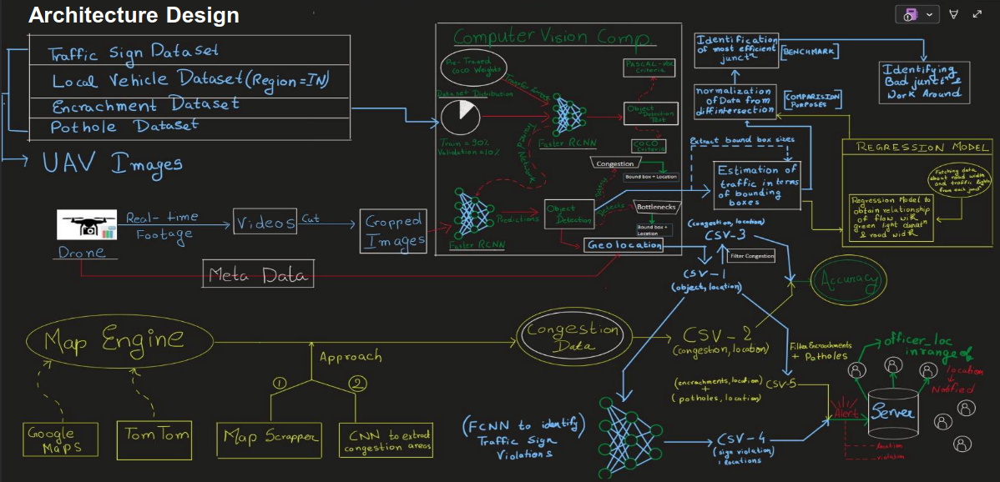

# M.A.R.G. - Machine-learning Assisted Road Guidance

### Prototype Link: [https://marg-ai.streamlit.app/](https://marg-ai.streamlit.app/)
**Demo Credentials:**
- Username: `ABCD12`
- Password: `ABCD12`


## Overview

M.A.R.G. is an intelligent traffic management system that leverages computer vision and machine learning to analyze urban traffic congestion, detect bottlenecks, and optimize traffic flow. Our solution provides real-time monitoring and actionable insights for traffic authorities.


## Problem Statement

Urban traffic congestion leads to significant economic losses, environmental impact, and decreased quality of life. Traditional traffic management methods often fall short in effectiveness and real-time responsiveness.

### Key Challenges:
- **Sub-Problem 1:** Evaluating traffic congestion shown by map engine services against actual congestion measured via drone footage
- **Sub-Problem 2:** Optimizing and evaluating junction performance with optimal signal timing
- **Sub-Problem 3:** Detecting traffic bottlenecks and generating real-time alerts

## Solution

We developed an object detection-based system using advanced computer vision components. By leveraging pre-trained models like YOLOv8 and supervision toolkit, our system can automatically detect and geo-reference bottlenecks and road congestions from images captured by onboard cameras in real-time.



*Note: Several modules in this proposed solution are still under active development*

## Technologies Used

- **Computer Vision:** YOLOv8, OpenCV, Supervision
- **Backend Framework:** Streamlit, Python
- **Machine Learning:** PyTorch, Ultralytics
- **Image Processing:** PIL, NumPy
- **Video Processing:** FFmpeg, OpenCV
- **Development Tools:** Git, Virtual Environment

## Setup Instructions

### Prerequisites
- Python 3.10
- pip package manager

### Installation Steps

1. **Clone the repository**
   ```bash
   git clone <repository-url>
   cd MARG
   ```

2. **Create and activate virtual environment**
   ```bash
   # Create virtual environment with Python 3.10
   python3.10 -m venv marg_env

   # Activate virtual environment
   # On Windows:
   marg_env\Scripts\activate
   # On macOS/Linux:
   source marg_env/bin/activate
   ```

3. **Install dependencies**
   ```bash
   pip install -r requirements.txt
   ```

4. **Run the application**
   ```bash
   streamlit run app.py
   ```

### Additional Configuration

For accessing the drawzones functionality in helper.py:
1. Open `helper.py`
2. Locate the `encroachment` function
3. Uncomment the `drawzones` function as needed

## Core Features

### 🖼️ Image Detection
- Detect various objects in uploaded images with configurable confidence levels
- Capable of extending to license plate recognition for traffic violators

### 🎥 Video Detection
- Analyze past video footage to verify claims and incidents
- Object detection with adjustable confidence thresholds

### 🌐 Real-time Detection
- **Webcam Detection:** Test feature demonstrating real-time object detection capabilities
- **RTSP Detection:** Real-time analysis from RTSP camera streams
- **YouTube Detection:** Process YouTube videos for demonstration purposes

### 🚨 Traffic Management
- **Encroachment Identification:** Custom-trained model on UAV and Indian vehicle datasets to identify bottlenecks
- **Real-time Alerts:** Automated notifications to authorities for traffic violations and congestion

### 📊 Junction Analysis
- **Dataset Generator:** Create training datasets from junction footage
- **Junction Evaluator:** Assess junction performance after optimal signal timing implementation

### 📈 Benchmarking
- Compare map engine congestion data against actual drone-calculated congestion
- Provide accuracy assessment of commercial mapping services

## Feature Demonstrations

### Image Detection
**Detection Results:**


### Video Detection
**Analysis Results:**


### Real-time Webcam Detection


### RTSP Stream Processing


### Bottleneck Detection & Alerts
- Tracks vehicles within marked zones
- Calculates wait-time periods
- Generates alerts for vehicles exceeding permissible duration


### Traffic Density Estimation
**Image-based Analysis:**


**Video-based Analysis:**


## Navigation

The application features a main content area with a comprehensive sidebar for accessing all functionalities. The sidebar organizes features into logical categories for easy navigation and workflow management.

## Future Enhancements

- Enhanced model accuracy with expanded training datasets
- Integration with more traffic management systems
- Advanced predictive analytics for traffic flow optimization
- Mobile application for field personnel
- API development for third-party integrations

---

**Note:** This project is under active development. Some features may be experimental and subject to change.
